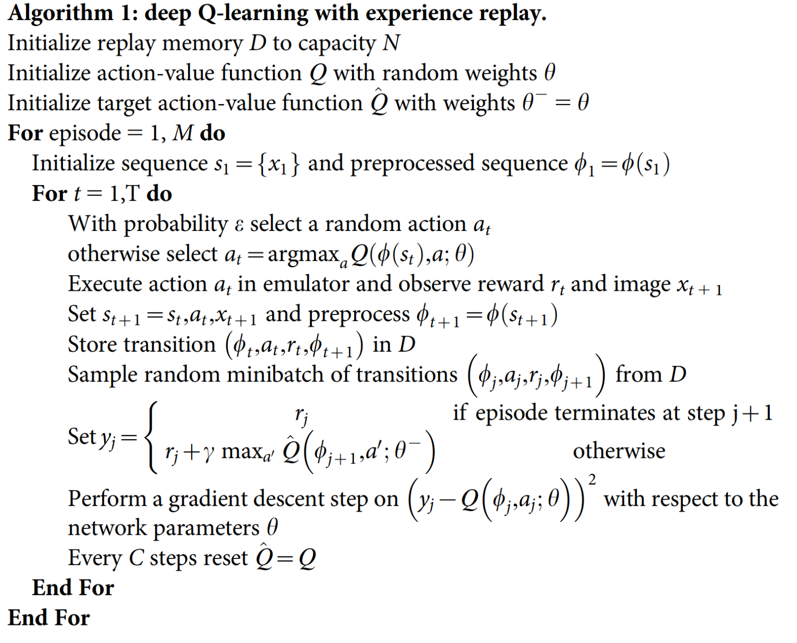
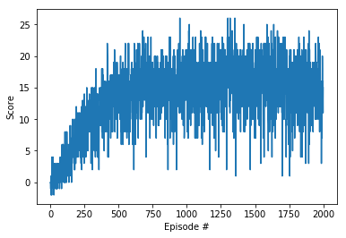

# Introduction
The goal of this project is to understand, adapt, and tune the implementation of Deep Q-Networks excersie to solve the navigation banana problem.
Using unity ML-Agents, the agent was able to acheive a score of 13 for more consecutive episodes.

# Learning Algorithm
The agent model used is a simple two layers one with 37 input size, state, and 4 output, actions.  

The hyper parameters used are of the same values used in the excercise. What follows is a description of each:
BUFFER_SIZE = int(1e5)  # The size of memory where the agent stores its experience to learn from. 
BATCH_SIZE = 64         # minibatch size
GAMMA = 0.99            # discount factor of reward
TAU = 1e-3              # for soft update of target parameters
LR = 5e-4               # learning rate for training the neural network
UPDATE_EVERY = 4        # how often to update the network

The learning algorithm works as follows, Q-learning with experience replay:

ref: https://storage.googleapis.com/deepmind-media/dqn/DQNNaturePaper.pdf

# Plot of Rewards

# Ideas for Future Work
* adding CNN layers to the network: this would enhance the representation of the environment.
* Dueling Q-learning: which is done by dividing the training to two streams. 1) estimates the state value function. 2) estimates the advantage for each action.
